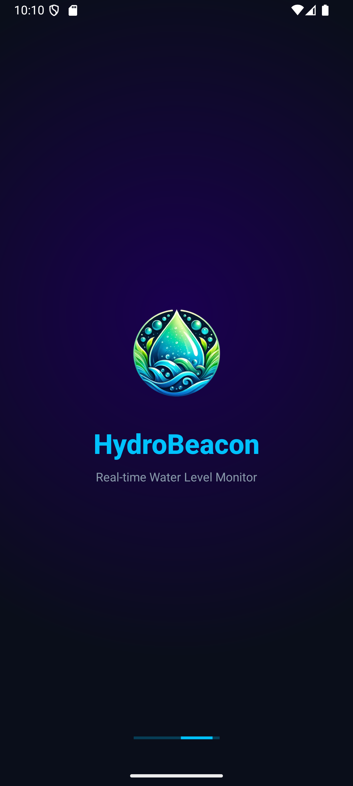
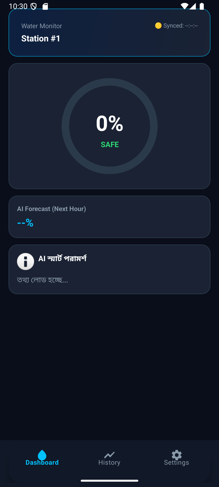
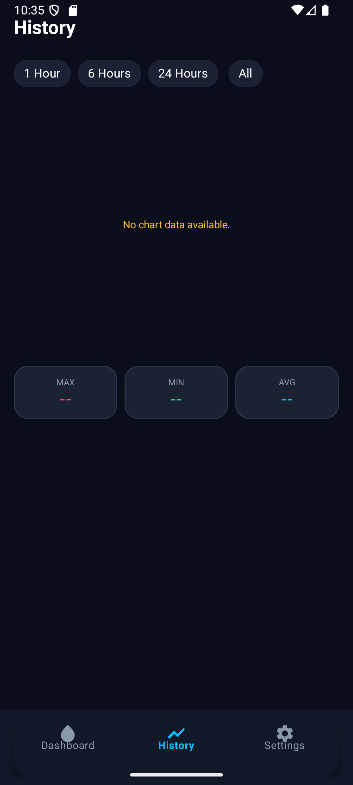
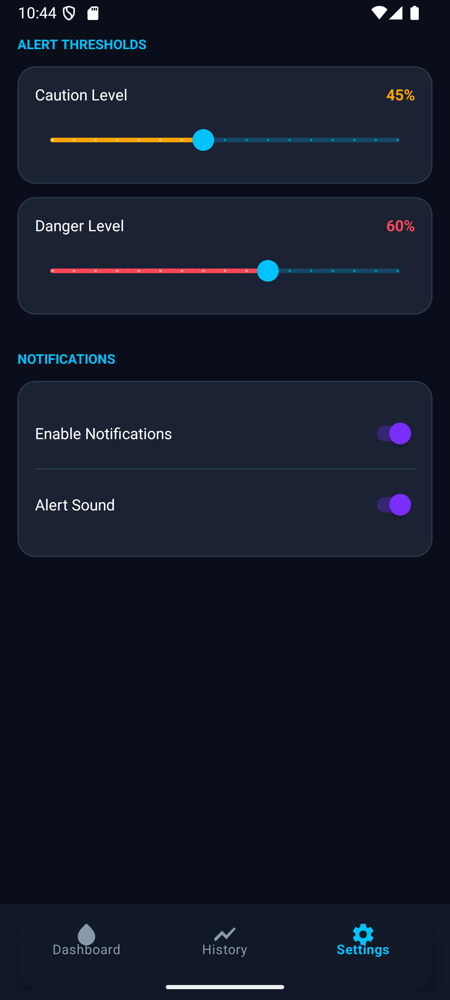

# 🌊 HydroBeacon: AI-Driven Flood Intelligence

[](https://opensource.org/licenses/MIT)
[](https://www.android.com/)
[](https://www.java.com/)

**HydroBeacon** is a sophisticated Android-based monitoring system designed to mitigate water-related risks through real-time telemetry, machine learning predictions, and generative AI guidance. It bridges the gap between raw IoT sensor data and actionable safety intelligence.

---

## 🌟 Key Features

### 📡 Real-Time Telemetry
*   **Firebase Integration:** Low-latency synchronization with Firebase Realtime Database for live water level updates.
*   **Intuitive Dashboard:** At-a-glance monitoring of current percentages and connection status.

### 🧠 Intelligent Analysis
*   **Predictive Modeling:** Utilizes local **TensorFlow Lite** models to forecast water level trends based on historical sequences.
*   **AI Safety Advisor:** Leverages **Google Gemini (LiteRT)** to provide contextual, human-readable safety advice and emergency protocols in real-time.

### 🔔 Smart Alerting & Visualization
*   **Custom Thresholds:** User-defined warning and critical levels for personalized risk management.
*   **Visual History:** Comprehensive data visualization using **MPAndroidChart** to identify long-term patterns.
*   **Push Notifications:** Instant critical alerts to ensure user safety even when the app is in the background.

---

## 🛠️ Technical Architecture

HydroBeacon is built on modern Android development principles:

*   **Architecture:** MVVM (Model-View-ViewModel) for clean separation of concerns.
*   **Dependency Injection:** Centralized dependency management via Version Catalogs (`libs.versions.toml`).
*   **AI Integration:** Dual-layer AI implementation using Google's Generative AI SDK and TensorFlow Lite.
*   **Hardware Interfacing:** 
    *   **CameraX:** Integrated for rapid visual site assessments.
    *   **Networking:** Retrofit for external weather API synchronization.

---

## 🚀 Getting Started

### Prerequisites
*   Android Studio Ladybug or newer.
*   Java 11 or higher.
*   A Firebase project with Realtime Database enabled.
*   Google Gemini API Key.

### Installation & Setup

1.  **Clone the Repository**
    ```bash
    git clone https://github.com/YOUR_USERNAME/HydroBeacon.git
    ```

2.  **Configuration**
    *   Place your `google-services.json` in the `app/` directory.
    *   Initialize your Gemini API key within the `AiAdvisorService` or local environment.

3.  **Build**
    *   The project uses Gradle's Version Catalog. Run a standard Gradle Sync to resolve all dependencies.
    *   *Note:* JNI library conflicts between LiteRT and TensorFlow are handled automatically via custom packaging configurations.

---

## 📸 Interface Preview

<div align="center">

| **Splash & Branding** | **Live Monitoring** | **Historical Trends** | **System Settings** |
|:---:|:---:|:---:|:---:|
|  |  |  |  |

</div>

---

## 🤝 Contributing

We welcome contributions from the community. Whether it's optimizing the prediction algorithms, enhancing the UI, or expanding localized advice, your input is valuable.

1.  Fork the Project
2.  Create your Feature Branch (`git checkout -b feature/AmazingFeature`)
3.  Commit your Changes (`git commit -m 'Add some AmazingFeature'`)
4.  Push to the Branch (`git push origin feature/AmazingFeature`)
5.  Open a Pull Request

---

## 📄 License

Distributed under the MIT License. See `LICENSE` for more information.

---
**Developed by [Md Khan Bahadur Sadi](https://github.com/YOUR_USERNAME)**  
*Empowering communities through AI-driven safety solutions.*
